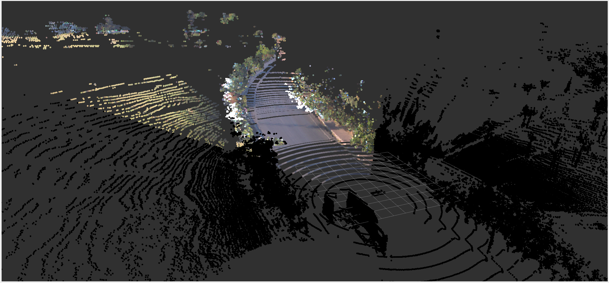
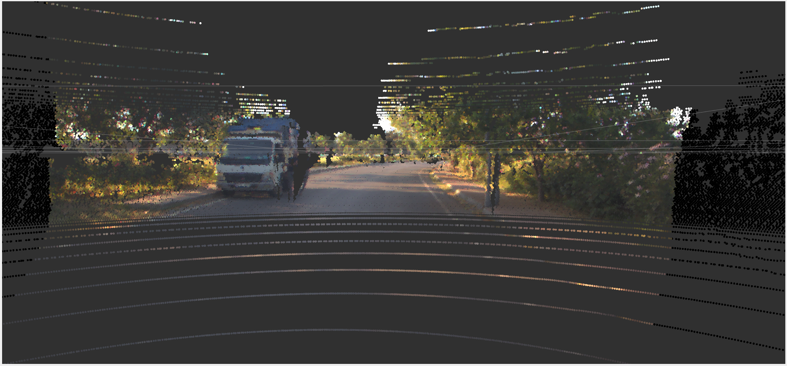
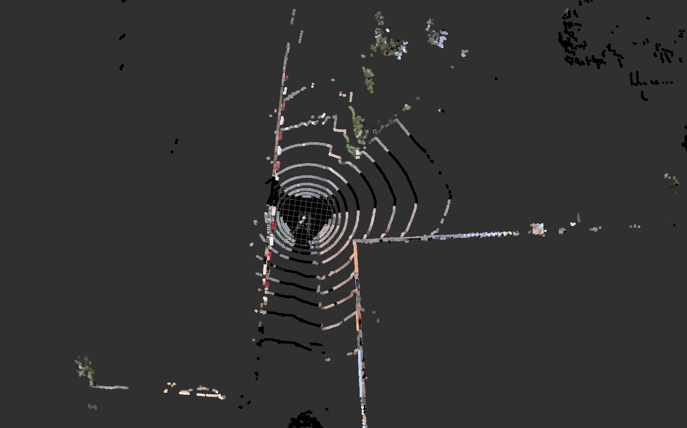
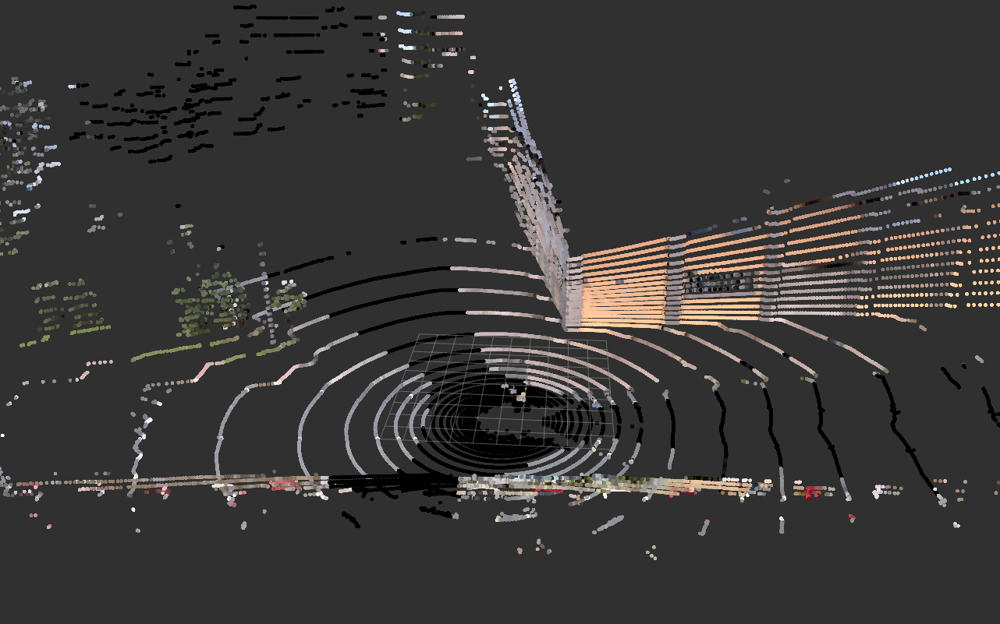
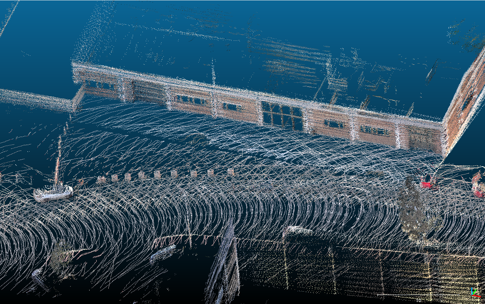
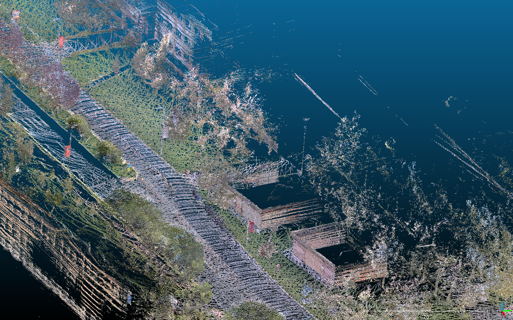

# color-point-cloud

Tool for colorize point cloud with images from camera. This tool takes a point cloud and
dynamic number of images from camera via ROS2 and colorize the point cloud with the images.

## Installation

### Prerequisites

- ROS2 (tested with Humble)
- OpenCV
- PCL
- Eigen3


### Build

```bash
mkdir -p ~/color_lidar_ws/src
cd ~/color_lidar_ws/src
git clone https://github.com/Longxiaoze/color-point-cloud.git
cd ..
colcon build --symlink-install
```

## Usage

### Run

```bash
source ~/color_lidar_ws/install/setup.bash
ros2 launch color_point_cloud color_point_cloud.launch.xml
```

### Parameters

Change parameters in `color_point_cloud.launch.xml` to fit your environment.

| Parameter | Description                             |  example |
| :-------- |:----------------------------------------| :------------------|
| `point_cloud_topic` | your lidar topic as `string`            | `/points_raw`  |
| `point_cloud_frame_id` | The coordinate system/frame in which the point cloud data is located.| check header in `/front_camera/camera_info` |
| `camera_topics` | array of your camera topics as `string` | `[/front_camera,...]` |
| `image_type` | your image format `enum`                | `0:RAW, 1:RECTIFIED` |
| `image_topic_last_name` | `image_topic` after `camera_topics` | `/image_raw` |
| `camera_info_topic_last_name` | `camera_info_topic` after `camera_topics` | `/camera_info` |

for example: /front_camera/camera_info + /front_camera/image_raw + /points_raw

### Result

#### Projection Lucid Vision Triton 5.4 MP 120° camera onto Velodyne Alpha Prime LiDAR

<p align='center'>
    
    
</p>

#### Projection AC-IMX390 camera onto RoboSense Helios 32 beam LiDAR

<p align='center'>
    
    
</p>

#### SLAM results with LIO-SAM ([link](https://github.com/leo-drive/LIO-SAM-COLOR))

<p align='center'>
    
    
</p>owner:Longxiaoze 
